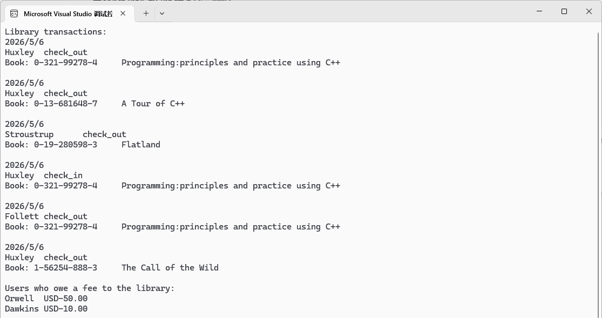

# C++ study by PPP

I created this project when I started learning from the book *Programming: Principles and Practice Using C++* (3rd Edition) by Bjarne Stroustrup.

It mainly contains example code from the book and solutions I wrote to solve its drill and exercises.

Sample programs:

Game Bulls and Cows from exercise 12 of chapter 4.

Simple calculator from chapter 6:

Design and implement classes: Book, Patron, Library, Date, Money, from exercises of chapter 8:

Superellipses drawn by using the GUI library provided by the book, from exercise 12 of chapter 10.

